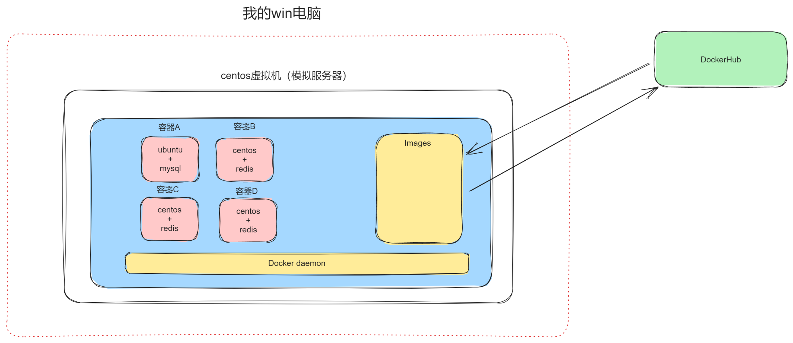
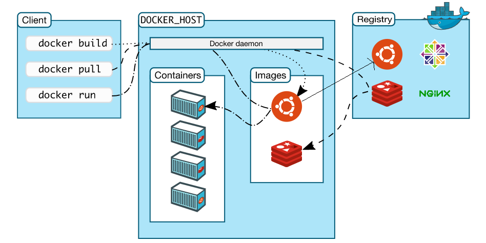
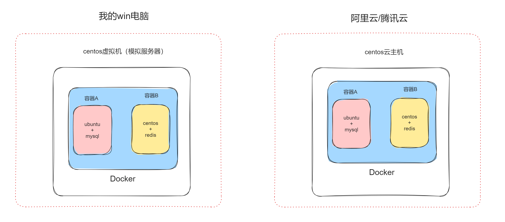

# 1.什么 docker？

docker就是一个**软件**，支持在win、mac、linux系统上进行安装。
可以帮助我们在一台电脑上创建出多个**隔离的环境**，比传统的虚拟机极大的**节省资源** 。
- 为什么要创建隔离的环境？
  
  ```
  假设你先在有一个centos7.6系统运行程序，而这个程序需要依赖【ubuntu系统的服务A】 + 【centos7.9的服务B】
  - 传统的方式：买新服务器
  - 虚拟化方式：在原来的NB服务器上利用虚拟化技术创建虚拟机（vmware、kvm等），用虚拟机做隔离去跑新的业务。
  - docker的方式：利用docker软件创建一个新的容器，用容器去做隔离区跑新的业务。
  
  ```
- 为什么docker可以比虚拟机极大的节省资源？
  
  ```
  - 虚拟机的方式，是在电脑完整的创建一个操作系统。
  - docker的方式，创建的容器不是完整的操作系统，而是充分利用宿主机内核+进程，只是创建了一些必备的资源。
  ```
  
  {:height 139, :width 865}
- # 2.必备概念
  
  
- DockerHub，远程镜像仓库。https://hub.docker.com/
  
  ```
  仓库中有官方的一些镜像文件，也有开发者自定义的镜像文件。
  ```
- Images，本地镜像仓库。
  
  ```
  可以去远程仓库下载镜像到本地仓库，后续再根据镜像为“模版”去创建容器。本地的镜像也可以发布到远程镜像库。
  ```
	- 镜像是之前用虚拟机创建操作系统时的ISO文件吗？
	  
	  ```
	  不是，此处是docker中的特殊的文件。
	  ```
	- 镜像是个什么样的文件？
	  
	  ```
	  镜像就是充当模版来使用，在他得内部包含打包好了的：运行所需依赖 + 业务代码。
	  后期基于镜像一键创建出的容器也就会自动包含依赖和业务代码，直接就可以运行了，不需要再安装+拷贝代码了。
	  ```
- Containers，容器。
  
  ```
  容器就是根据镜像创造出来的一个个隔离的环境。
  ```
  
  
  
  
- # 3.环境准备
  
  
  
  
- 学习环境：win电脑  ->  centos7虚拟机【docker】   -> docker容器
- 线上环境：云平台    ->  购买云主机【docker】          -> docker容器
  
  
  
  
  
  ```
  讲师：武沛齐
  微信：wupeiqi666
  B站主页：
  https://space.bilibili.com/336469068
  https://space.bilibili.com/283478842
  ```