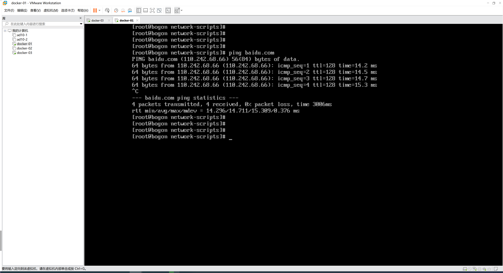

# 学习环境准备


- 在win电脑安装：**vmware工具** + **创建centos系统（初始化）**

# 1.VMware

## 1.1 下载安装

> 下载后，无脑点击安装即可。


## 1.2 虚拟化支持


注意：开启后重启即可，如果电脑提示无法启动，则需要先进入bios在主板中设置开启支持Hyper-V。


# 2.CentOS系统

https://mirrors.tuna.tsinghua.edu.cn/centos/7.9.2009/isos/x86_64/


```
>>>uname -r
>>>cat /etc/redhat-release
```


# 3.网络配置

默认登录无法上网，需要配置下网络才行。


## 3.1 Win电脑

配置DNS和网关


## 3.2 CentOS主机


```
TYPE=Ethernet
PROXY_METHOD=none
BROWSER_ONLY=no
BOOTPROTO=static         # 由原来的dhcp改成static
DEFROUTE=yes
IPV4_FAILURE_FATAL=no
IPV6INIT=yes
IPV6_AUTOCONF=yes
IPV6_DEFROUTE=yes
IPV6_FAILURE_FATAL=no
IPV6_ADDR_GEN_MODE=stable-privacy
NAME=ens33
UUID=cfbd5cd7-fa17-48e6-9d13-715f33e1f08d
DEVICE=ens33
ONBOOT=yes              # 由原来的no改成yes
IPADDR=192.168.115.133  # 新增，当前主机的IP
GATEWAY=192.168.115.2   # 网关
NETMASK=255.255.255.0   # 掩码
DNS1=8.8.8.8            # NDS服务器
DNS2=8.8.4.4            # NDS服务器
```


```
service network restart
```

```
systemctl restart network
```


重启后，可以ping百度测试：

```
ping baidu.com
```




# 4.系统初始化

- 关闭selinux

  - 查看状态

    ```
    getenforce
    ```

  - 临时关闭

    ```
    setenforce 0
    ```

  - 永久关闭

    ```
    vi /etc/selinux/config
    ```

    ```
    # 设置为disabled
    SELINUX=disabled
    ```

- 防火墙

  - 查看防火墙状态

    ```
    systemctl status firewalld
    ```

  - 关闭

    ```
    systemctl stop firewalld
    ```

  - 关闭开机启动防火墙

    ```
    systemctl disable firewalld
    ```

- net-tools

  ```
  yum install net-tools -y
  ```

- openssh-server

  ```
  yum install openssh-server -y
  ```

  ```
  systemctl start sshd.service
  ```

  ```
  systemctl enable sshd.service
  ```

- 可以在win上用xshell等工具SSH连接centos

- wget

  ```
  yum install wget -y
  ```
  
- centos常用工具包

  ```
  yum install -y wget bash-completion vim lrzsz wget expect net-tools nc nmap tree dos2unix htop iftop iotop unzip telnet sl psmisc nethogs glances bc ntpdate openldap-devel
  ```


```
讲师：武沛齐
微信：wupeiqi666
B站主页：
	https://space.bilibili.com/336469068
	https://space.bilibili.com/283478842
```


