# 1.docker宿主机

当前宿主机的系统是centos，安装了docker，后续可以在centos之上创建多个容器。

# 2.项目部署：Flask

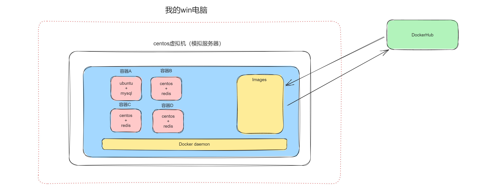


将项目代码放在docker的宿主机的 /opt/app.py 中。

让docker可以帮我们在centos的宿主机中创建ubuntu系统，并安装相关环境，然后再运行flask程序。

需求：假设现在我有一个Flask程序，希望你通过docker将他部署在**ubuntu**的操作系统上运行。

```python
from flask import Flask

app = Flask(__name__)

@app.route("/index")
def index():
    return "欢迎光临红浪漫"

if __name__ == "__main__":
    app.run(host="0.0.0.0",port=8000)
```


## 2.1 下载基础镜像

https://hub.docker.com/_/ubuntu/tags


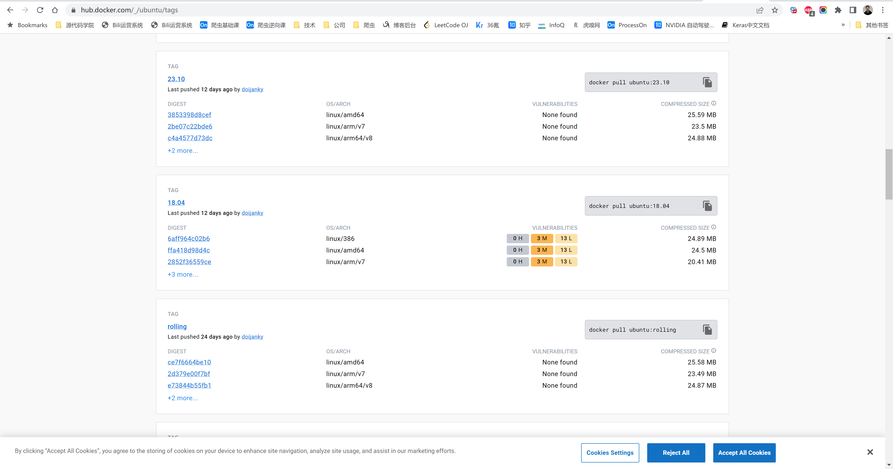


```shell
[root@192 ~]# docker images
REPOSITORY     TAG       IMAGE ID       CREATED          SIZE
[root@192 ~]#
[root@192 ~]#
[root@192 ~]# docker pull ubuntu:18.04
[root@192 ~]#
[root@192 ~]#
18.04: Pulling from library/ubuntu
284055322776: Pull complete 
Digest: sha256:0fedbd5bd9fb72089c7bbca476949e10593cebed9b1fb9edf5b79dbbacddd7d6
Status: Downloaded newer image for ubuntu:18.04
docker.io/library/ubuntu:18.04
[root@192 ~]# 
[root@192 ~]# 
[root@192 ~]# docker images
REPOSITORY     TAG       IMAGE ID       CREATED          SIZE
ubuntu         18.04     5a214d77f5d7   20 months ago    63.1MB
[root@192 ~]# 
[root@192 ~]# 
```


这个只有基础镜像，我们可以在基础镜像的基础上创造出一个新的镜像：基础镜像 + 必备环境 + 代码。

后续基础新的镜像来创建容器并运行。

## 2.2 构建镜像

### 2.2.1 编写Dockerfile

```shell
# Base images 基础镜像
FROM ubuntu:18.04

[[MAINTAINER]] 维护者信息
LABEL maintainer wupeiqi@live.com

[[RUN]] 执行以下命令
RUN apt update
RUN apt install python3  python3-pip  -y
RUN pip3 install flask
RUN mkdir -p /data/www/

[[拷贝文件至工作目录]]
COPY app.py  /data/www/app.py

[[工作目录]]
WORKDIR /data/www/

[[EXPOSE]] 映射端口
EXPOSE 80

[[容器启动时执行命令]]
CMD ["python3","app.py"]
```


### 2.2.2 构建镜像

```
[root@192 crm]# docker build  -t v0:0.1  .  -f Dockerfile 
[+] Building 0.0s (12/12) FINISHED              
 => [internal] load build definition from Dockerfile         
 => => naming to docker.io/library/v1:0.01                0.0s
 ...
 => => naming to docker.io/library/v1:0.01
[root@192 crm]# 
[root@192 crm]# docker images
REPOSITORY     TAG       IMAGE ID       CREATED         SIZE
v1             0.01      0dd632180107   3 minutes ago   513MB
ubuntu         18.04     5a214d77f5d7   20 months ago   63.1MB
centos         latest    5d0da3dc9764   20 months ago   231MB
```

## 2.3 容器

基于刚构建的镜像，来创建容器并启动。

```
[root@192 crm]# docker images
REPOSITORY      TAG       IMAGE ID       CREATED         SIZE
v1              0.01      cd885cb29f41   9 minutes ago   513MB
ubuntu          18.04     5a214d77f5d7   20 months ago   63.1MB
[root@192 crm]# 
[root@192 crm]# 
[root@192 crm]# docker run -d -p 80:8000  cd885cb29f41
93352e1c52ec397233b33ca88545c3dd8ab9f6f2c3c93ad292944d8f4d570bc8
[root@192 crm]# 
[root@192 crm]# docker ps
CONTAINER ID   IMAGE          COMMAND            CREATED          STATUS          PORTS      
93352e1c52ec   cd885cb29f41   "python3 app.py"   42 seconds ago   Up 42 seconds   ...
[root@192 crm]# 
[root@192 crm]# docker ps
[root@192 crm]# docker ps -a
[root@192 crm]# docker stop 933
[root@192 crm]# docker rm 933
```

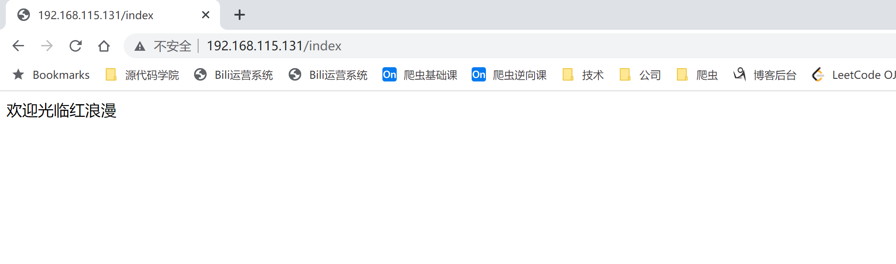


# 3.Dockerfile

## 3.1 指令

Dockerfile是一堆指令，在docker build的时候，按照该指令进行操作，最终生成我们期望的镜像

- FROM 指定基础镜像，必须为第一个命令

  ```
  格式：
  	FROM <image>
  	FROM <image>:<tag>
  示例：
  	FROM mysql:5.7
  注意：
  	tag是可选的，如果不使用tag时，会使用latest版本的基础镜像
  ```

- MAINTAINER 镜像维护者的信息

  ```
  格式：
  	MAINTAINER <name>
  示例：
  	MAINTAINER wupeiqi
      MAINTAINER wupeiqi@live.com
      MAINTAINER wupeiqi <wupeiqi@live.com>
  ```

- ENV

  ```
  格式：
      ENV <key> <value>
      ENV <key>=<value>
  示例：
      ENV myName John
      ENV myCat=fluffy
  ```

- COPY|ADD  添加本地文件到镜像中    app.py              /data/www/info/app.py

  ```
  格式：
  	COPY <src>... <dest>
  示例：
      ADD hom* /mydir/          # 添加所有以"hom"开头的文件
      ADD test relativeDir/     # 添加 "test" 到 $WORKDIR/relativeDir/
      ADD test /absoluteDir/    # 添加 "test" 到 /absoluteDir/
      
  注意：针对压缩包使用ADD的话，会自动解压。
  ```

- WORKDIR 工作目录

  ```
  格式：
  	WORKDIR /path/to/workdir
  示例：
      WORKDIR /a  (这时工作目录为/a)
  注意：
  	通过WORKDIR设置工作目录后，Dockerfile中其后的命令RUN、CMD、ENTRYPOINT、ADD、COPY等命令都会在该目录下执行
  ```

- RUN 构建镜像过程中执行命令

  ```
  格式：
  	RUN <command>
  示例：
      RUN yum install nginx
      RUN pip install django
      RUN mkdir test && rm -rf /var/lib/unusedfiles
  注意：
  	RUN指令创建的中间镜像会被缓存，并会在下次构建中使用。如果不想使用这些缓存镜像，可以在构建时指定--no-cache参数，如：docker build --no-cache
  ```

- CMD 构建容器后调用，也就是在容器启动时才进行调用

  ```
  格式：
      CMD ["executable","param1","param2"] (执行可执行文件，优先)
      CMD ["param1","param2"] (设置了ENTRYPOINT，则直接调用ENTRYPOINT添加参数)
      CMD command param1 param2 (执行shell内部命令)
  示例：
      CMD ["/usr/bin/wc","--help"]
      CMD ping www.baidu.com
  注意：
  	CMD不同于RUN，CMD用于指定在容器启动时所要执行的命令，而RUN用于指定镜像构建时所要执行的命令。
  ```

- ENTRYPOINT 设置容器初始化命令，使其可执行化

  ```
  格式：
      ENTRYPOINT ["executable", "param1", "param2"] (可执行文件, 优先)
      ENTRYPOINT command param1 param2 (shell内部命令)
  示例：
      ENTRYPOINT ["/usr/bin/wc","--help"]
  注意：
  	ENTRYPOINT与CMD非常类似，不同的是通过docker run执行的命令不会覆盖ENTRYPOINT，而docker run命令中指定的任何参数，都会被当做参数再次传递给ENTRYPOINT。Dockerfile中只允许有一个ENTRYPOINT命令，多指定时会覆盖前面的设置，而只执行最后的ENTRYPOINT指令
  ```

- EXPOSE 暴漏端口

  ```
  格式：
      EXPOSE <port> [<port>...]
  示例：
      EXPOSE 80 443
      EXPOSE 8080
      EXPOSE 11211/tcp 11211/udp
  注意：
      就是一个端口的标识，实际开发时，没什么意义。因为端口的映射会在run命令时进行指定。
  ```


## 3.2 构建

```
docker build  -t v1:0.01  .  -f Dockerfile 
```

```
docker build  -t v1:0.01  .  -f Dockerfile  --no-cache
```


## 2.2 案例

### 案例1：基础指令

```shell
# Base images 基础镜像
FROM ubuntu:18.04

[[MAINTAINER]] 维护者信息
LABEL maintainer wupeiqi wupeiqi@live.com

# 环境变量
ENV PRO_PATH /data/www

[[RUN]] 执行以下命令
RUN mkdir -p PRO_PATH

[[RUN]] 执行以下命令
RUN mkdir -p $PRO_PATH/mediea

[[COPY]] 拷贝文件至工作目录
COPY *.py  $PRO_PATH/

[[ADD]] 拷贝文件至工作目录+解压
ADD *.tgz  $PRO_PATH/mediea/

[[工作目录]]
WORKDIR /data/www/
```


构建镜像：

```
docker build  -t v1:0.01  .  -f Dockerfile1
```


创建容器：

```shell
# 创建容器，退出结束（因为容器中没有前台进程）
docker run v1:0.01

# 创建容器，主动创建一个前台的输入进程
docker run -i v1:0.01
docker run -i v1:0.01 bash
docker run -i v1:0.01 sh

# 创建容器，主动创建一个前台的输入进程，不卡宿主机
docker run -di v1:0.01 
docker run -di v1:0.01 bash
docker run -di v1:0.01 sh

# 创建容器，主动创建一个ping的进程
docker run centos ping baidu.com

# 创建容器，主动创建一个ping的进程，不卡住宿主机
docker run -d centos ping baidu.com

# 创建容器，主动创建一个终端+输入输出进程，进入容器内交互（退出容器停止）
docker run -ti centos bash
docker run -ti centos /bin/sh
docker run -ti v0:0.1 bash

# 创建容器，并进入容器内，退出时结束容器后，自动删除。
docker run -ti --rm centos bash

# ############ 在正式开发时 ###############
# 创建容器（编辑镜像，让容器启动时自动创建一个前台进程）
docker run -d v0:0.1

# 后期想要进入正在存活的容器
docker exec -it 容器ID bash
```

```shell
# 批量停止容器
docker stop `docker ps -aq`

# 批量删除容器
docker rm `docker ps -aq`
```


### 案例2：CMD

CMD用于指定在容器启动时所要执行的命令，而RUN用于指定镜像构建时所要执行的命令。

例如：容器启动时，必须要有一个前台进程，一般在容器创建后去启动时，基于CMD运行一个前台进程。

```shell
# Base images 基础镜像
FROM ubuntu:18.04

[[MAINTAINER]] 维护者信息
LABEL maintainer wupeiqi wupeiqi@live.com

# 环境变量
ENV PRO_PATH /data/www

[[RUN]] 执行以下命令
RUN apt update
RUN apt install inetutils-ping -y

[[RUN]] 执行以下命令
RUN mkdir -p PRO_PATH

[[RUN]] 执行以下命令
RUN mkdir -p $PRO_PATH/mediea

[[COPY]] 拷贝文件至工作目录
COPY *.py  $PRO_PATH/

[[ADD]] 拷贝文件至工作目录+解压
ADD *.tgz  $PRO_PATH/mediea/

[[WORKDIR]] 工作目录
WORKDIR /data/www/

# CMD 容器启动时自动执行的前台进程
#     1.可以有多个CMD，但只有最后一个生效。
#     2.CMD的命令会被docker run覆盖
# CMD ping baidu.com

CMD ["ping","baidu.com"]
```


构建镜像：

```
docker build  -t v1:0.2  .  -f Dockerfile2
```

创建容器+启动：

```shell
# 创建容器，由镜像中有前台线程，用-d参数，别卡主屏幕
docker run -d v1:0.2
```

```shell
# 后面的命令会覆盖CMD
docker run -d v1:0.2  ping pythonav.com
docker run -d v1:0.2  tail -f /data/www/app.py
```


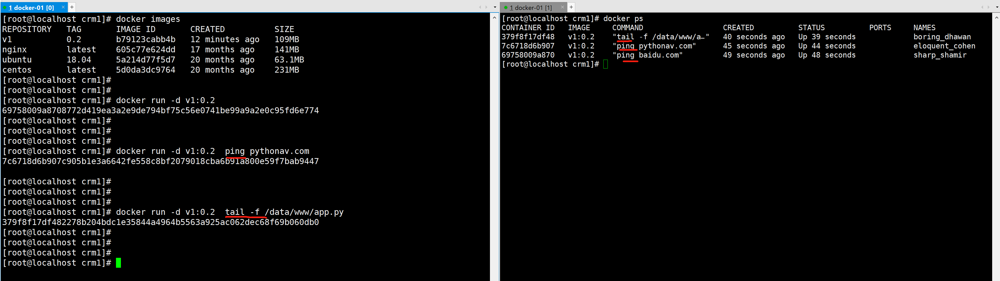


### 案例3：ENTRYPOINT

ENTRYPOINT与CMD非常类似。

不同的是通过docker run执行的命令不会覆盖ENTRYPOINT，而docker run命令中指定的任何参数，都会被当做参数再次传递给ENTRYPOINT。

Dockerfile中只允许有一个ENTRYPOINT命令，多定义会覆盖前面的设置，而只执行最后的ENTRYPOINT指令

```
格式：
    ENTRYPOINT ["executable", "param1", "param2"] (可执行文件, 优先)
    ENTRYPOINT command param1 param2 (shell内部命令)
示例：
    ENTRYPOINT ["/usr/bin/wc","--help"]
```

```shell
# Base images 基础镜像
FROM ubuntu:18.04

[[MAINTAINER]] 维护者信息
LABEL maintainer wupeiqi wupeiqi@live.com

# 环境变量
ENV PRO_PATH /data/www

[[RUN]] 执行以下命令
RUN apt update
RUN apt install inetutils-ping -y

[[RUN]] 执行以下命令
RUN mkdir -p PRO_PATH

[[RUN]] 执行以下命令
RUN mkdir -p $PRO_PATH/mediea

[[COPY]] 拷贝文件至工作目录
COPY *.py  $PRO_PATH/

[[ADD]] 拷贝文件至工作目录+解压
ADD *.tgz  $PRO_PATH/mediea/

[[WORKDIR]] 工作目录
WORKDIR /data/www/

# ENTRYPOINT 容器启动时自动执行的前台进程
#     1.可以有多个ENTRYPOINT，但只有最后一个生效。
#     2.docker run传入的命令不会覆盖ENTRYPOINT，而是当成参数向后传入给ENTRYPOINT
ENTRYPOINT ["ping","baidu.com"]
```


构建镜像：

```
docker build  -t v1:0.4  .  -f Dockerfile4
```

创建容器+启动：

```shell
# 创建容器，由镜像中有前台线程，用-d参数，别卡主屏幕
docker run -d v1:0.4
```

```shell
# 后面的命令不会覆盖ENTRYPOINT，而是当成参数向后传入给ENTRYPOINT
docker run -d v1:0.4  ping pythonav.com
docker run -d v1:0.4  tail -f /data/www/app.py
```


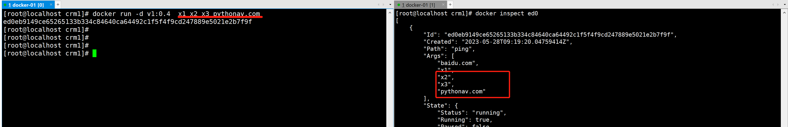


### 案例4：EXPOSE

EXPOSE表示容器暴漏的端口。

就是一个端口的标识，实际开发时，没什么意义。因为端口的映射会在 `docker run` 命令时进行指定。

```shell
# Base images 基础镜像
FROM ubuntu:18.04

[[MAINTAINER]] 维护者信息
LABEL maintainer wupeiqi@live.com

[[RUN]] 执行以下命令
RUN apt update
RUN apt install python3  python3-pip  -y
RUN pip3 install flask
RUN mkdir -p /data/www/

[[拷贝文件至工作目录]]
COPY app.py  /data/www/app.py

[[工作目录]]
WORKDIR /data/www/

[[EXPOSE]] 映射端口
EXPOSE 8000

[[容器启动时执行命令]]
CMD ["python3","app.py"]
```


构建镜像：

```
docker build  -t v1:0.5  .  -f Dockerfile5
```

创建容器+启动：

```shell
# 创建容器，由镜像中有前台线程，用-d参数，别卡主屏幕
docker run -d -p 80:8000 v1:0.5
```

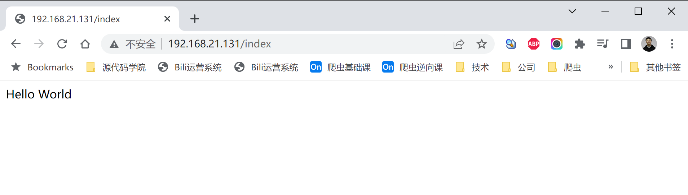


# 4.实践：Django部署

在centos7.9中部署gitee上的django3.2项目。


## 4.1 下载基础镜像

```shell
[root@localhost crm1]# 
[root@localhost crm1]# 
[root@localhost crm1]# docker pull centos:7.9.2009
7.9.2009: Pulling from library/centos
2d473b07cdd5: Pull complete 
Digest: sha256:9d4bcbbb213dfd745b58be38b13b996ebb5ac315fe75711bd618426a630e0987
Status: Downloaded newer image for centos:7.9.2009
docker.io/library/centos:7.9.2009
[root@localhost crm1]# 
[root@localhost crm1]# 
[root@localhost crm1]# docker images
REPOSITORY   TAG        IMAGE ID       CREATED             SIZE
nginx        latest     605c77e624dd   17 months ago       141MB
ubuntu       18.04      5a214d77f5d7   20 months ago       63.1MB
centos       7.9.2009   eeb6ee3f44bd   20 months ago       204MB
```


## 4.2 构建镜像


### 4.2.1 编写Dockerfile

```shell
# Base images 基础镜像
FROM centos:7.6.1810

[[MAINTAINER]] 维护者信息
LABEL maintainer wupeiqi@live.com


# GCC编译器
RUN yum install gcc -y

# Python依赖
RUN yum install -y zlib zlib-devel bzip2 bzip2-devel ncurses ncurses-devel readline readline-devel openssl openssl-devel  xz lzma xz-devel sqlite sqlite-devel gdbm gdbm-devel tk tk-devel  mysql-devel python-devel libffi-devel

# wget
RUN yum install wget -y

# 目录
RUN mkdir -p /data/
WORKDIR /data/

# SQLite升级
RUN wget https://www.sqlite.org/2023/sqlite-autoconf-3420000.tar.gz  --no-check-certificate
RUN tar -zxvf sqlite-autoconf-3420000.tar.gz
WORKDIR /data/sqlite-autoconf-3420000
RUN ./configure
RUN make && make install
ENV LD_LIBRARY_PATH="/usr/local/lib"

# Python3.9环境
WORKDIR /data/
RUN wget https://www.python.org/ftp/python/3.9.5/Python-3.9.5.tgz
RUN tar -xvf Python-3.9.5.tgz
WORKDIR /data/Python-3.9.5/
RUN ./configure
RUN make && make install
RUN pip3.9 config set global.index-url https://pypi.douban.com/simple/

# git
RUN yum install git -y
RUN git config --global user.name "武沛齐"
RUN git config --global user.email "wupeiqi@live.com"

# git拉代码
WORKDIR /data/
RUN git clone https://gitee.com/wupeiqi/blog.git


# 虚拟环境
RUN pip3.9 install virtualenv
RUN virtualenv  /envs/dj --python=python3.9
RUN /envs/dj/bin/pip3.9 install django==3.2

# 运行项目
WORKDIR /data/blog

CMD ["/envs/dj/bin/python","manage.py","runserver","0.0.0.0:9000"]
```


### 4.2.2 构建镜像

```
docker build -t dj  .  -f Dockerfile
```


### 4.2.3 启动容器

```shell
# 测试启动
docker run -p 80:9000 --rm dj

# 正经启动
docker run -d -p 80:9000 dj
```

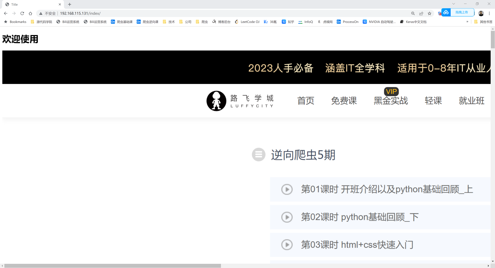


## 4.3 制作和导出

后期在项目部署时，会经常使用：CentOS + Python3.9.5 的环境，为了避免每次都编译生成，我们可以自己制作一个【CentOS + Python3.9.5 】的基础镜像，便于后续使用。


### 4.3.1 编写Dockerfile

```python
# Base images 基础镜像
FROM centos:7.6.1810

[[MAINTAINER]] 维护者信息
LABEL maintainer wupeiqi@live.com


# GCC编译器
RUN yum install gcc -y

# Python依赖
RUN yum install -y zlib zlib-devel bzip2 bzip2-devel ncurses ncurses-devel readline readline-devel openssl openssl-devel  xz lzma xz-devel sqlite sqlite-devel gdbm gdbm-devel tk tk-devel  mysql-devel python-devel libffi-devel

# wget
RUN yum install wget -y

# 目录初始化
RUN mkdir -p /data/
WORKDIR /data/

# SQLite升级
RUN wget https://www.sqlite.org/2023/sqlite-autoconf-3420000.tar.gz  --no-check-certificate
RUN tar -zxvf sqlite-autoconf-3420000.tar.gz
WORKDIR /data/sqlite-autoconf-3420000
RUN ./configure
RUN make && make install
ENV LD_LIBRARY_PATH="/usr/local/lib"
RUN rm -rf /data/sqlite-autoconf-3420000*

# Python3.9环境
WORKDIR /data/
RUN wget https://www.python.org/ftp/python/3.9.5/Python-3.9.5.tgz
RUN tar -xvf Python-3.9.5.tgz
WORKDIR /data/Python-3.9.5/
RUN ./configure
RUN make && make install
RUN rm -rf /data/Python-3.9.5

RUN pip3.9 config set global.index-url https://pypi.douban.com/simple/
```


### 4.3.2 构建镜像

```shell
docker build -t  wupeiqi/centos76py39:v1  .  -f  Dockerfile
```


### 4.3.3 本地导出和导入

构建好的镜像可以打包至本地压缩包，可以发送给其他人导入使用。

- 导出

  ```shell
  [root@192 data]# docker images
  REPOSITORY             TAG        IMAGE ID       CREATED         SIZE
  ubuntu                 18.04      5a214d77f5d7   20 months ago   63.1MB
  centos                 7.6.1810   f1cb7c7d58b7   4 years ago     202MB
  [root@192 data]# docker build -t  wupeiqi/centos76py39:v1  .  -f  Dockerfile
  [root@192 data]# docker images
  REPOSITORY             TAG        IMAGE ID       CREATED         SIZE
  wupeiqi/centos76py39   1.0        f16ab6d9d538   3 minutes ago   1.53GB
  ubuntu                 18.04      5a214d77f5d7   20 months ago   63.1MB
  centos                 7.6.1810   f1cb7c7d58b7   4 years ago     202MB
  [root@192 data]# 
  [root@192 data]#
  [root@192 data]# 
  [root@192 data]# 
  [root@192 data]# docker image save wupeiqi/centos76py39:1.0 > /data/centos76py39.tgz
  [root@192 data]#
  ```

- 导入

  ```shell
  [root@192 data]# 删除镜像，一定要提前把容器删除（ps -a)
  [root@192 data]# docker rmi f16
  [root@192 data]# 
  [root@192 data]# 
  [root@192 data]# docker images
  REPOSITORY   TAG        IMAGE ID       CREATED         SIZE
  ubuntu                 18.04      5a214d77f5d7   20 months ago   63.1MB
  centos                 7.6.1810   f1cb7c7d58b7   4 years ago     202MB
  [root@192 data]# 
  [root@192 data]# 
  [root@192 data]# docker image load -i /data/centos76py39.tgz 
  Loaded image: wupeiqi/centos76py39:1.0
  [root@192 data]# 
  [root@192 data]# 
[root@192 data]# docker images
  REPOSITORY             TAG        IMAGE ID       CREATED         SIZE
  wupeiqi/centos76py39   1.0        f16ab6d9d538   3 minutes ago   1.53GB
  ubuntu                 18.04      5a214d77f5d7   20 months ago   63.1MB
  centos                 7.6.1810   f1cb7c7d58b7   4 years ago     202MB
  ```
  
  


### 4.3.4 发布和下载

- 注册hub.docker.com账号

- 在docker中登录 & 上传镜像

  ```shell
  [root@192 data]# 
  [root@192 data]# docker login
  Login with your Docker ID to push and pull images from Docker Hub. If you don't have a Docker ID, head over to https://hub.docker.com to create one.
  Username: wupeiqi
  Password: 
  Login Succeeded
  [root@192 data]# 
  [root@192 data]# docker push wupeiqi/centos76py39:1.0
  The push refers to repository [docker.io/wupeiqi/centos76py39]
  3e44f2add787: Pushed 
  dcf9cfa1b48a: Pushed 
  4be8f0fb8953: Pushed 
  89169d87dbe2: Mounted from library/centos 
  1.0: digest: sha256:eebbf157deba8d1f85677a0ec23022e7e00fb62e66286 size: 4508
  ```

- 后续使用

  ```
  docker pull wupeiqi/centos76py39:1.0
  ```

  

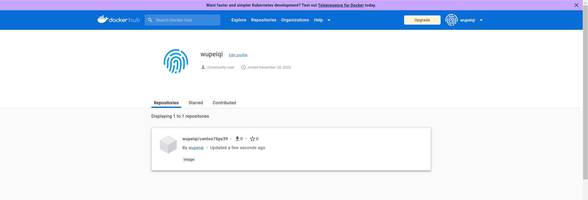

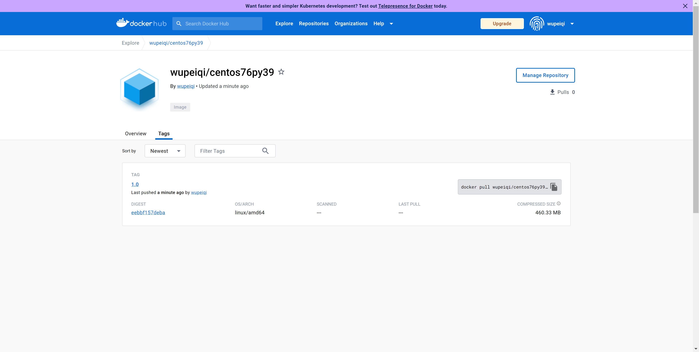


# 5.实践：django+uwsgi+nginx

在centos7.6服务器上，部署：django3.2 + uwsgi + nginx 环境 。


## 5.1 下载基础镜像

```shell
[root@192 data]# 
[root@192 data]# docker pull wupeiqi/centos76py39:1.0
1.0: Pulling from wupeiqi/centos76py39
Digest: sha256:eebbf157deba8d1f85677a0ec23022e110a34538807b4cbfde7e00fb62e66286
Status: Downloaded newer image for wupeiqi/centos76py39:1.0
docker.io/wupeiqi/centos76py39:1.0
[root@192 data]#
[root@192 data]#
[root@192 data]# docker images
REPOSITORY             TAG        IMAGE ID       CREATED          SIZE
wupeiqi/centos76py39   1.0        f16ab6d9d538   28 minutes ago   1.53GB
nginx                  latest     605c77e624dd   17 months ago    141MB
ubuntu                 18.04      5a214d77f5d7   20 months ago    63.1MB
centos                 7.6.1810   f1cb7c7d58b7   4 years ago      202M
[root@192 data]#
[root@192 data]#

```


## 5.2 构建镜像

### 5.2.1 代码

https://gitee.com/wupeiqi/blog.git


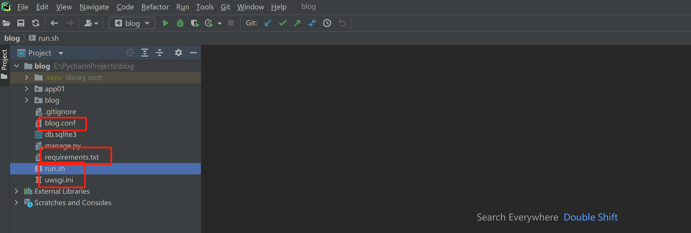

#### blog.conf

```
worker_processes 2;

error_log /var/log/nginx/error.log;
pid /run/nginx.pid;

events {
    worker_connections 1024;
}

http {
    log_format  main  '$remote_addr - $remote_user [$time_local] "$request" '
                      '$status $body_bytes_sent "$http_referer" '
                      '"$http_user_agent" "$http_x_forwarded_for"';

    access_log  /var/log/nginx/access.log  main;

    sendfile            on;
    tcp_nopush          on;
    tcp_nodelay         on;
    keepalive_timeout   65;
    types_hash_max_size 4096;

    include             /etc/nginx/mime.types;
    default_type        application/octet-stream;


    upstream django {
        server 127.0.0.1:8001;
    }

    server {
        listen       80;
        listen       [::]:80;

        # Load configuration files for the default server block.
        # include /etc/nginx/default.d/*.conf;

	    location /static {
            alias  /data/allstatic;
        }

        location /media {
            alias  /data/media;
        }

        location / {
            uwsgi_pass  django;
            include     uwsgi_params;
        }
    }
}
```

#### run.sh

```
/envs/blog/bin/uwsgi --ini ./uwsgi.ini &  >/dev/null
nginx -c /etc/nginx/myblog.conf -g 'daemon off;'
```

#### uwsgi.ini

```
[uwsgi]
socket = 127.0.0.1:8001
chdir = /data/blog/
wsgi-file = blog/wsgi.py
processes = 2
virtualenv = /envs/blog/
```


### 5.2.2 编写Dockerfile

```shell
# Base images 基础镜像
FROM wupeiqi/centos76py39:1.0

[[MAINTAINER]] 维护者信息
MAINTAINER wupeiqi@live.com

# git
RUN yum install git -y
RUN git config --global user.name "武沛齐"
RUN git config --global user.email "wupeiqi@live.com"

# git拉代码  /data/blog
WORKDIR /data/
RUN git clone https://gitee.com/wupeiqi/blog.git

# 虚拟环境
WORKDIR /data/blog/
RUN pip3.9 install virtualenv
RUN virtualenv  /envs/blog --python=python3.9
RUN /envs/blog/bin/pip3.9 install -r requirements.txt

# 收集静态资源  /data/allstatic/
WORKDIR /data/blog/
RUN /envs/blog/bin/python manage.py collectstatic

# 安装uwsgi
RUN /envs/blog/bin/pip3.9 install uwsgi

# 安装nginx
WORKDIR /data/blog/
RUN rpm -Uvh  http://nginx.org/packages/centos/7/noarch/RPMS/nginx-release-centos-7-0.el7.ngx.noarch.rpm
RUN yum install nginx -y
# 易错点
RUN cp /data/blog/blog.conf /etc/nginx/myblog.conf

# 运行项目
WORKDIR /data/blog

# CMD ["/envs/blog/bin/uwsgi","--ini","uwsgi.ini"]
# CMD ["nginx","-c","/etc/nginx/myblog.conf","-g","daemon off;"]
CMD ["/bin/sh","run.sh"]
```


### 5.2.3 构建镜像

```shell
docker build -t web  .  -f Dockerfile  --no-cache
```


### 5.2.4 启动容器

```
# 测试启动
docker run -p 80:80 --rm web

# 正经启动
docker run -d -p 80:80 web
```


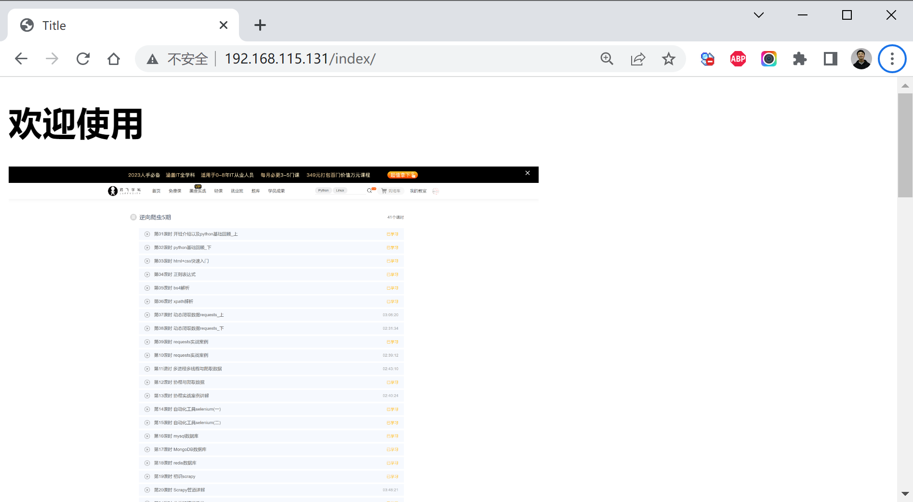


```
讲师：武沛齐
微信：wupeiqi666
B站主页：
	https://space.bilibili.com/336469068
	https://space.bilibili.com/283478842
```


