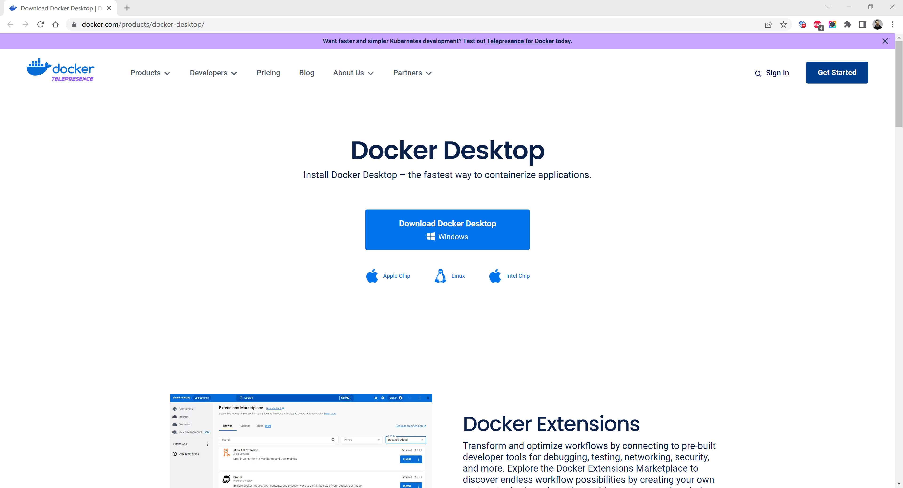
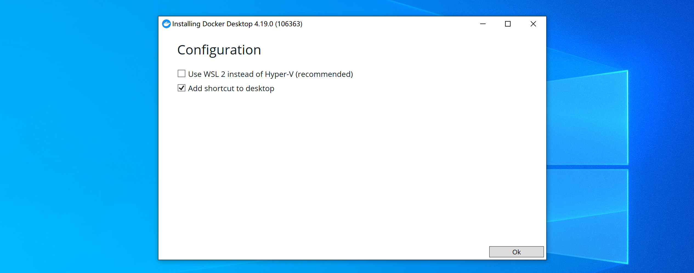
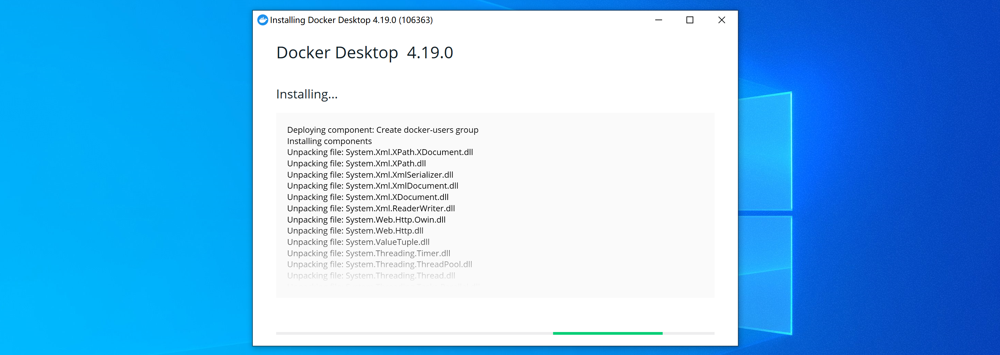
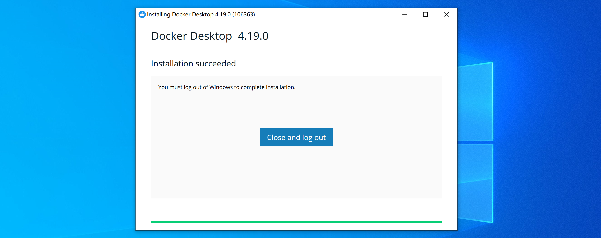
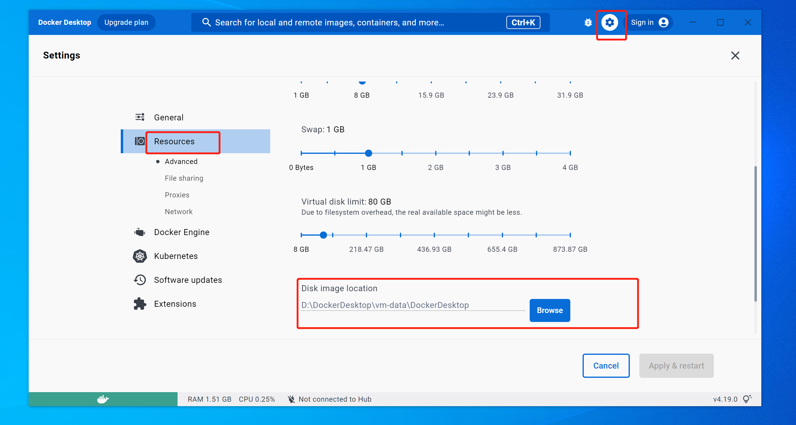
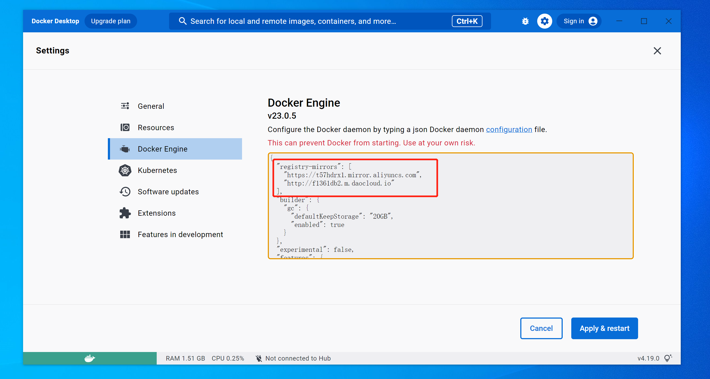
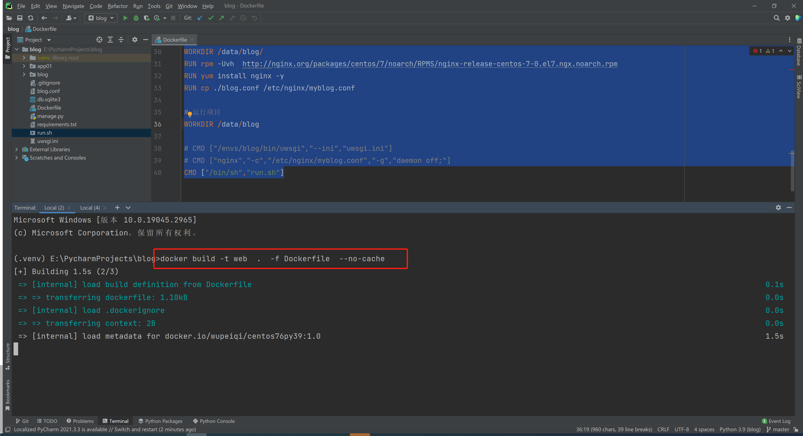
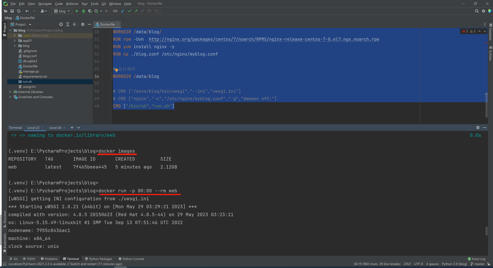
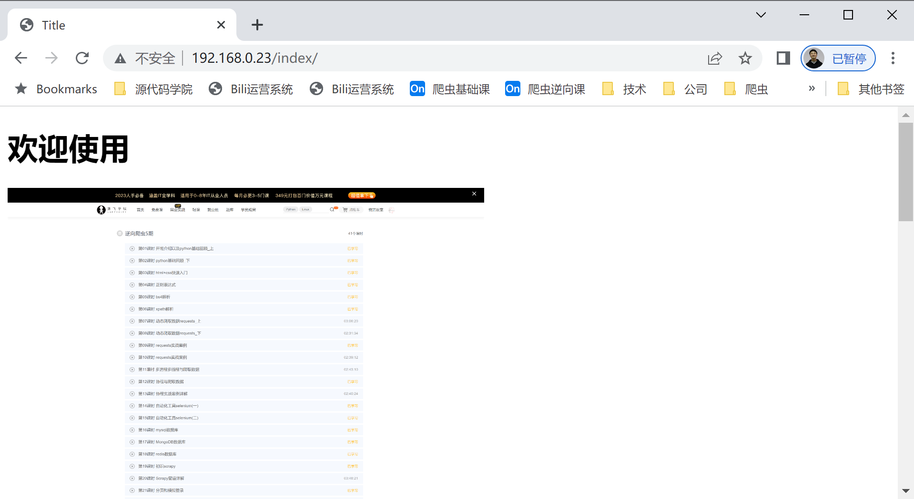
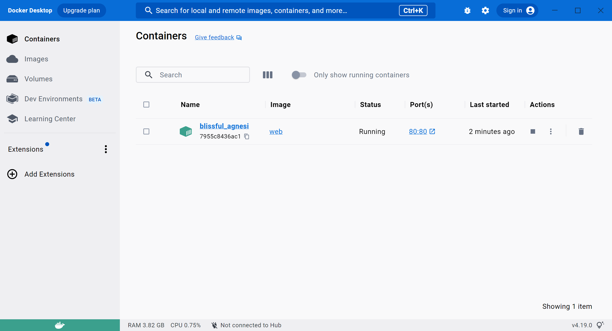

# 1.安装Docker
在win开发机上安装docker，当开发完成项目之后，可以直接构建镜像并启动容器运行。
{:height 119, :width 1018}

下载地址：https://www.docker.com/products/docker-desktop/













- # 2.构建镜像
  
  代码：https://gitee.com/wupeiqi/blog
- ## 2.1 Dockerfile
  
  ```dockerfile
  # Base images 基础镜像
  FROM wupeiqi/centos76py39:1.0
  
  [[MAINTAINER]] 维护者信息
  MAINTAINER wupeiqi@live.com
  
  # git
  RUN yum install git -y
  RUN git config --global user.name "武沛齐"
  RUN git config --global user.email "wupeiqi@live.com"
  
  # git拉代码
  WORKDIR /data/
  RUN git clone https://gitee.com/wupeiqi/blog.git
  
  # 虚拟环境
  WORKDIR /data/blog/
  RUN pip3.9 install virtualenv
  RUN virtualenv  /envs/blog --python=python3.9
  RUN /envs/blog/bin/pip3.9 install -r requirements.txt
  
  # 收集静态资源
  WORKDIR /data/blog/
  RUN /envs/blog/bin/python manage.py collectstatic
  
  # 安装uwsgi
  RUN /envs/blog/bin/pip3.9 install uwsgi
  
  # 安装nginx
  WORKDIR /data/blog/
  RUN rpm -Uvh  http://nginx.org/packages/centos/7/noarch/RPMS/nginx-release-centos-7-0.el7.ngx.noarch.rpm
  RUN yum install nginx -y
  RUN cp ./blog.conf /etc/nginx/myblog.conf
  
  # 运行项目
  WORKDIR /data/blog
  
  # CMD ["/envs/blog/bin/uwsgi","--ini","uwsgi.ini"]
  # CMD ["nginx","-c","/etc/nginx/myblog.conf","-g","daemon off;"]
  CMD ["/bin/sh","run.sh"]
  ```
- ## 2.2 构建镜像
  
  ```dockerfile
  # 构建
  docker build -t web  .  -f Dockerfile
  
  # 构建不使用缓存
  docker build -t web  .  -f Dockerfile  --no-cache
  ```
  
  
- ## 2.3 运行
- ### 5.2.4 启动容器
  
  ```
  # 测试启动
  docker run -p 80:80 --rm web
  docker run -p 80:80 --name web1 --rm web
  
  # 正经启动
  docker run -d -p 80:80 web
  ```
  
  
  
  
  
  
  
  
  
  
  

  ```
  讲师：武沛齐
  微信：wupeiqi666
  B站主页：
  https://space.bilibili.com/336469068
  https://space.bilibili.com/283478842
  ```